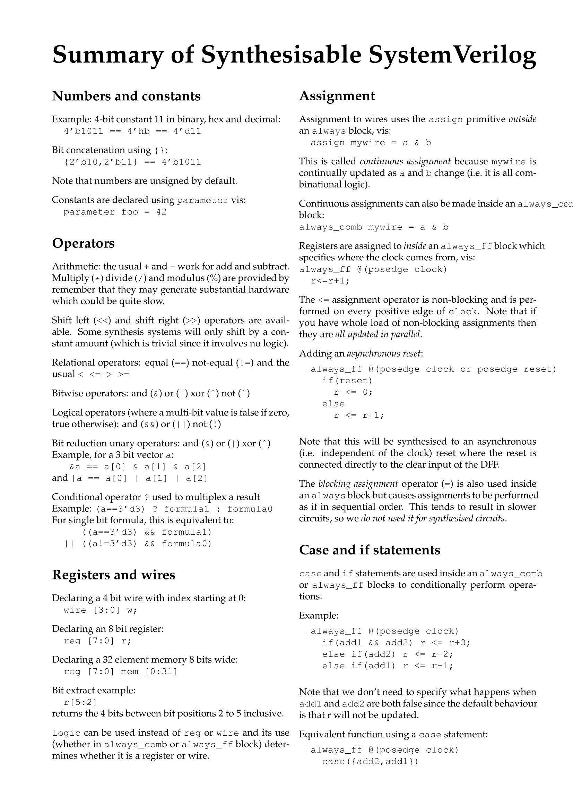
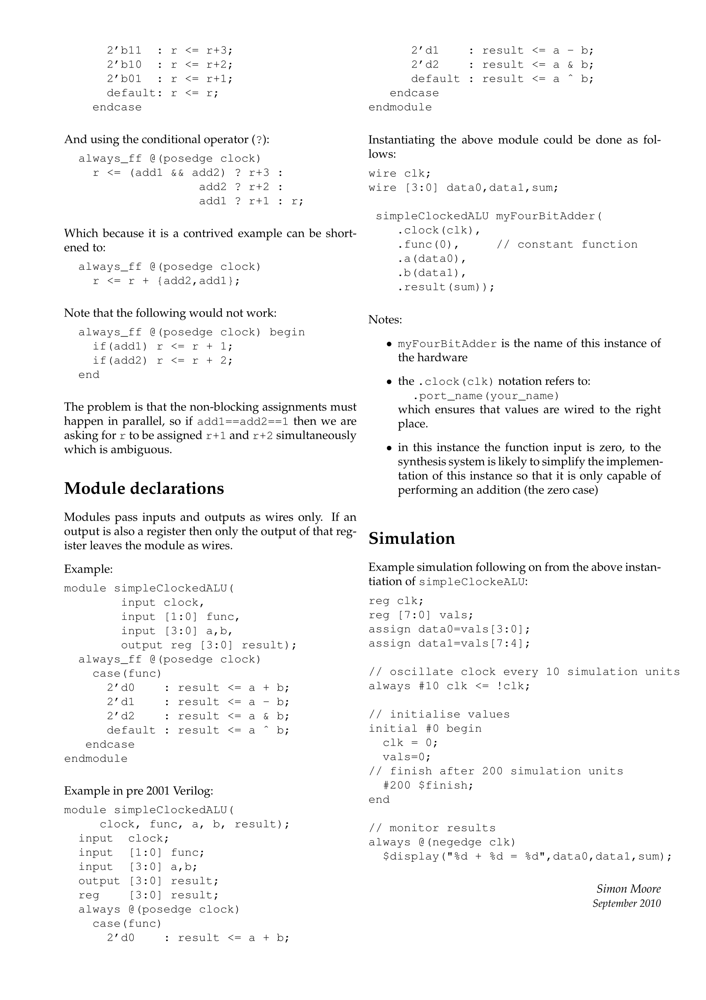

CS 325 @ Oregon State Univercity
================================
### [Course Description](http://supacyan.github.io/pages/fpga/des.html)

* [Lab 1](./lab1)
* [Lab 2](./lab2)
* [Lab 3](./lab3)
* [Lab 4](./lab4)
* [Lab 5](./lab5)
* [Lab 6](./lab6)
* [Lab 7](./lab7)
* [ModelSim](./ModelSim)

