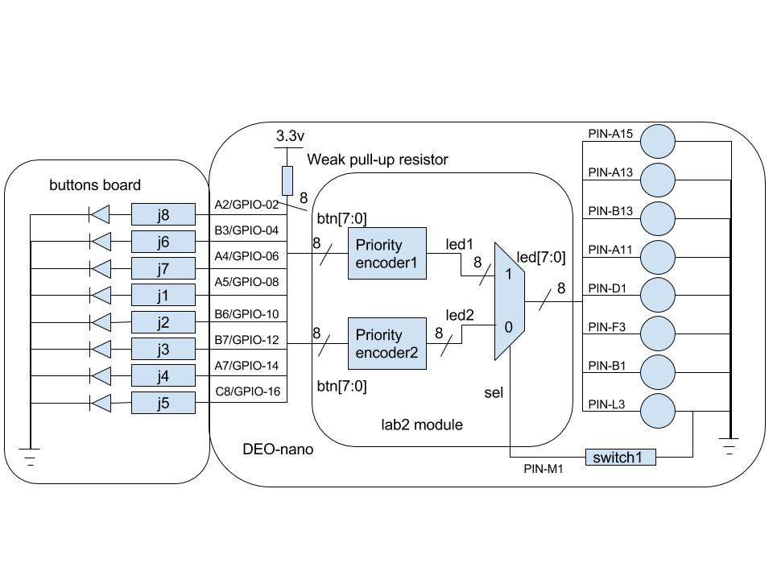

# ECE474 Homework 2

We have seen the design of mutiplier in class. 
In this assignment, you will.....

  -create a multiplier
  -create a simulation do file to test the multiplier       
  -synthesize the multiplier
  -rerun the simulation do file on the gate image of the multiplier 

In addition, you will write a bash shell script to document and
direct the operation of most of the steps.  We will also learn how
to have the simulator capture both simulation inputs and outputs.

Work to do:

1. create a 32-bit multiplier called "mult" from it.
  This module will be in a file called mult.sv.  The module 
definition for multiplier should look like this:
```verilog
module mult( 
  input  reset,
  input  clk,
  input  [31:0] a_in,
  input  [31:0] b_in,
  input  start,
  output logic [63:0] product,
  output logic done);
```
Prior to coding multiplier, hand-draw a block diagram of the internals 
of mult.  This drawing will show the external ports to mult.Drawing this
first will help clear your thinking about how the block is connected.

2. To test mult, create a simulation dofile "mult.do" to test your
mult. Include a test case to see the result.  

My .do file look like this:
```
	force a_in 10#14
	force b_in 10#9
	add wave -position insertpoint  \
	sim:/mult/a_in \
	sim:/mult/b_in \
	sim:/mult/clk \
	sim:/mult/reset \
	sim:/mult/start \
	sim:/mult/done \
	sim:/mult/product \
	sim:/mult/prod_reg_high \
	sim:/mult/prod_reg_ld_high \
	sim:/mult/prod_reg_low \
	sim:/mult/prod_reg_shift_rt \
	sim:/mult/reg_a
	force -freeze sim:/mult/clk 1 0, 0 {50 ns} -r 100
	force reset 1
	force start 0
	run 200
	run 50
	force reset 0
	run 100
	run 50
	force start 1
	run 100
	force start 0
	run 500
	run 8000
```
Take a screen shot of timing diagram. Perform this 


3. To synthesize mult, create a synthesis TCL script like the one we
have used in class. Call it "syn_mult". You will need to read in mult,
compile, then write out the gate-level verilog netlist to 
mult.gate.v.  Note that we use "*.v" and not "*.sv" as the netlist will 
be in Verilog and not in System Verilog format. Also, use the command
read_sverilog instead of read_verilog for synthesis.

4. Finally, create a bash shell script to do all the steps for you following
the basic script shown in the class notes.  Your script should read somewhat
like this: (this is pseudocode guys!)
```
if (/work directory does not exist) then
  {create it}

if (mult.sv exist) then
  {compile them}

if (mult.do exists) then
  {invoke the simulator, run the simulation, and quit}
```  
   Note1: upon invocation of vsim, use the "-t 1ps" switch to keep 
          timebases consistent.  It defaults to nS.
   Note2: You will probably get at message: "# Missing signal name or pattern"
          This can be safely ignored.
```
if (the script syn_mult exists) then
  {synthesize mult by executing the script}

if (the gate library has not been compiled yet) then
  {synthesize the cell library into /work }
```
Hint: to check for prior compilation, look in work/_info, grep cell name 
```
if (mult.gate.v exists) then
  {compile it}
```
invoke the simulator, run the simulation, and quit

compare the results between the two runs of simulation
hint: consider using: "diff" and file size checking  

print a user message telling if the comparison failed

5. To turn in:
  hand drawing of mult block diagram    %20
  source code:  mult.sv                 %20
  TCL scripts:  mult.do, syn_mult       %20
  bash script:  doit.sh                 %40

Some ideas:
  -Running the simulator in gui mode gets to be a hassle.  You can
run it in quiet, gui-less, "console mode" (hence the -c) like this:
```
vsim mult -do mult.do -quiet -c -t 1ps
```
  -Ditto for the synthesis tool.  You can run synthesis quietly by 
invoking like this:
```
dc_shell-xg-t -f <synthesis TCL file>
```


