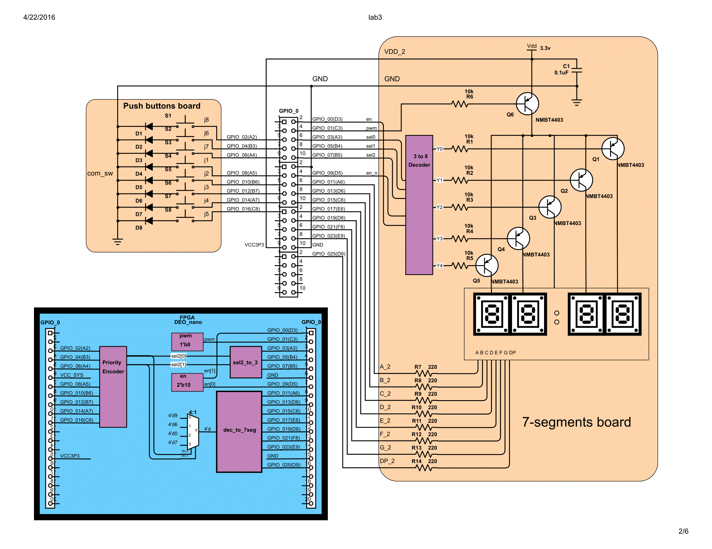

# ECE 474 Homework 3
### Verilog combinatorial circuits

--Background--
We are learning about many of the synthesizable Verilog constructs for creating 
combinatorial circuits. This exercise will give us an opportunity to start using
these constructs with synthesis.

We will create a multifunction ALU with 11 opcodes. It will have two 8-bit operand
inputs, an 8-bit output, plus outputs for a zero indication and carry. The opcodes 
will be supplied by one 4-bit bus.

Work to do:
1. Create a hw3 working directory. Remember to copy .synopsys_dc.setup into it. 
   Create a work directory.
   Make a rtl_src directory where your alu.sv source file will be placed.

2. Create the ALU with the filename alu.sv.  The module _must_ look as follows:
```verilog
  module alu(
      input        [7:0] in_a     ,  //input a
      input        [7:0] in_b     ,  //input b
      input        [3:0] opcode   ,  //opcode input
      output  reg  [7:0] alu_out  ,  //alu output
      output  reg        alu_zero ,  //logic '1' when alu_output [7:0] is all zeros
      output  reg        alu_carry   //indicates a carry out from ALU 
      );
  endmodule
```

  Declare all the opcodes in the module as follows.  
```verilog
  parameter c_add = 4'h1;
  parameter c_sub = 4'h2;
  parameter c_inc = 4'h3;
  parameter declaration for an opcode...
  parameter declaration for an opcode...
  ...
```
  Note the use of the prefix "c_" to mark the identifier as a constant.
  The opcodes for the ALU are as follows:  
```verilog
  c_add        in_a + in_b
   c_sub        in_a - in_b 
   c_inc        in_a + 1
   c_dec        in_a - 1
   c_or         in_a OR in_b
   c_and        in_a AND in_b
   c_xor        in_a XOR in_b
   c_shr        in_a is shifted one place right, zero shifted in
   c_shl        in_a is shifted one place left, zero shifted in
   c_onescomp   in_a gets "ones complemented"
   c_twoscomp   in_a gets "twos complemented"
```
   The value of carry is as follows: 
   -arithmetic operation      : includes: c_add, c_sub, c_inc, c_dec, c_twoscomp
                              : set if operation results in a carry to the 9th bit
   -non-arithmetic operation  : zero      
   -shift left                : set to the value of the MSB bit that was shifted out
   
   The signal alu_zero should propagate X if alu_out has any bits that are X. 

3. Compile alu.sv and simulate it to determine it works correctly by creating a 
   input stimulus do file by hand.

   The stimulus file should apply the operands and opcodes to test your alu. Both
   valid and invalid opcodes should be supplied.  
   
   Run a RTL simulation that shows correct operation. Print the waveform from vsim using 
   hex format for signals.  

4. Now synthesize the RTL and produce the gate level design. 
      Determine the following and put your answers on a separate sheet:
      a. Find the total area used by the alu. (report_area command)
      b. How many different types of cells (gates) were utilized : (report_hierarchy command)
      c. Number of cells (gates).  This will require using the report_area command as well 
         as looking at the cell library databook. It is located at:   
	 /nfs/guille/a1/cadlibs/synop_lib/SAED_EDK90nm/Digital_Standard_Cell_Library/doc/databook
	 Its is called SAED Digital Standard Cell Library_Rev1_4_20.  Its is a pdf file but has 
         no .pdf on it.  Search for the cell "NAND2X1" and record the area. (pg 34)  Divide the 
         total area reported by design_vision by this number to get the gate equivalent count.
      d. The synthesis tool will most likely introduce a hierarchical block to your design 
         because it recognized something in your design. What is the block and what does it do?
	 What style of implementation was chosen for this element? 
	 Hint: see report_hierarchy output
      e. What was the maximum delay path through the alu and what were the
	 beginning and endpoints for the max delay path?: (report_timing command)

What to turn in:
  1. Your Verilog code
  2. Turn in the schematic of your synthesized alu 
  3. The waveform of your code working correctly at both RTL and gate levels.
  4. The sheet with your written answers from part 4 above.  On this sheet,
     describe any problems or issues your design had.
  

Grading
  -Verilog coding and correct operation   70%
    -RTL matches gates for valid opcodes 
     and operands                       (-10%)
    -no latches in design               (-10%)
  -waveform printout                      10%
  -Written answers (part 4, a-e)          20%

## RTL schematic created by Chauncey Yan with DigiKey Schemit


