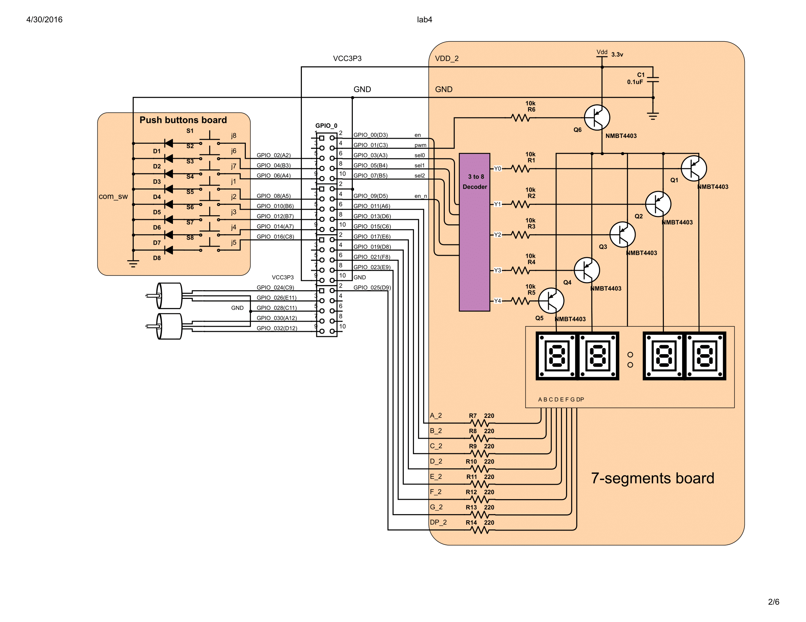
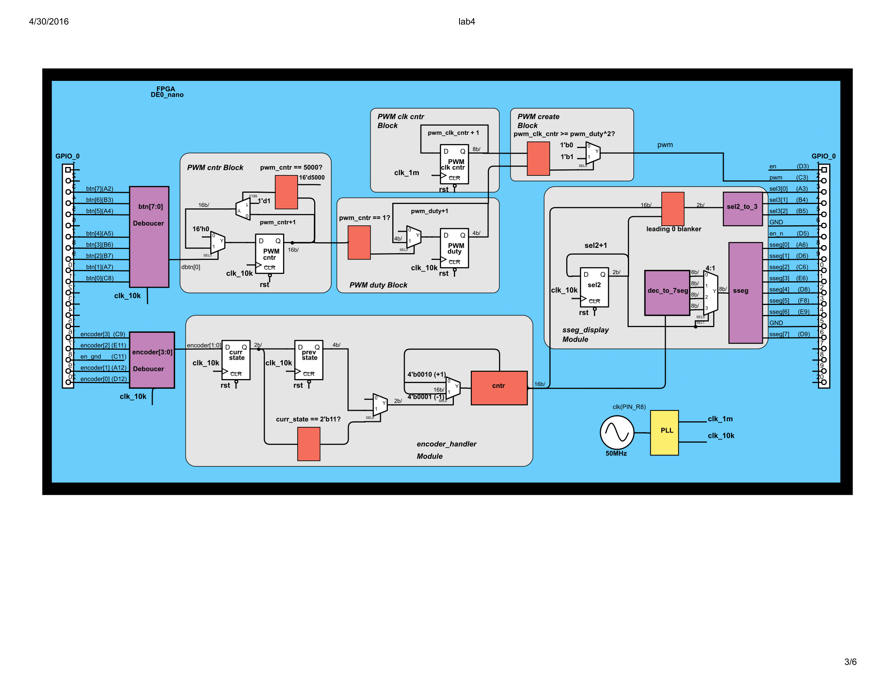

# ECE 474 Homework 4
### FIFO design - Designing with simple data and control paths

Your task for this homework is to implement a 8-bit wide, 8 byte deep
first-in, first-out memory (FIFO). It must exhibit fall-through behavior
in that when written, data is immediately available at the output. Reading
and writing are accomplished using read and write strobes (rd, wr) which 
are validated respectively by separate clocks (rd_clk, wr_clk). The FIFO
will have a single asynchronous, active low reset pin (reset_n). The FIFO 
must be capable of reading and writing independently using clocks that 
have no known phase relationship.

The FIFO will also have full and empty flag outputs which indicate if 
the FIFO is full and empty.  Empty is a combinatorial output when
asserted by (rd) and its deassertion is synchronized by rd_clk. Full is 
a combinatorial output when asserted by (wr) and its deassertion is 
synchronized by wr_clk.


Work to do:

1. Code your FIFO using the module template shown below: It MUST be defined at 
its top level and named as shown below:
```verilog
module fifo ( 
       input            wr_clk,   //write clock
       input            rd_clk,   //read clock
       input            reset_n,  //reset async active low
       input            wr,       //write enable 
       input            rd,       //read enable    
       input      [7:0] data_in,  //data in
       output reg [7:0] data_out, //data out
       output           empty,    //empty flag
       output           full      //full flag
endmodule
```
2. Test your fifo using the supplied testbench to insure correct behavior.  A 
   testbench that you can use to test the functionality for your FIFO will be
   posted for your aid in debugging.

What to turn in:
  An untared, unzipped file (fifo.sv) to TEACH by the due date. 
  A copy of your verilog code printed from a2ps is to be submitted
  (physically) in class on the due date. 

Grading
  -Correct operation of your FIFO             -90%
  -Code cleanliness, coding efficiency, style -10%

## RTL schematic created by Chauncey Yan with DigiKey Schemit



