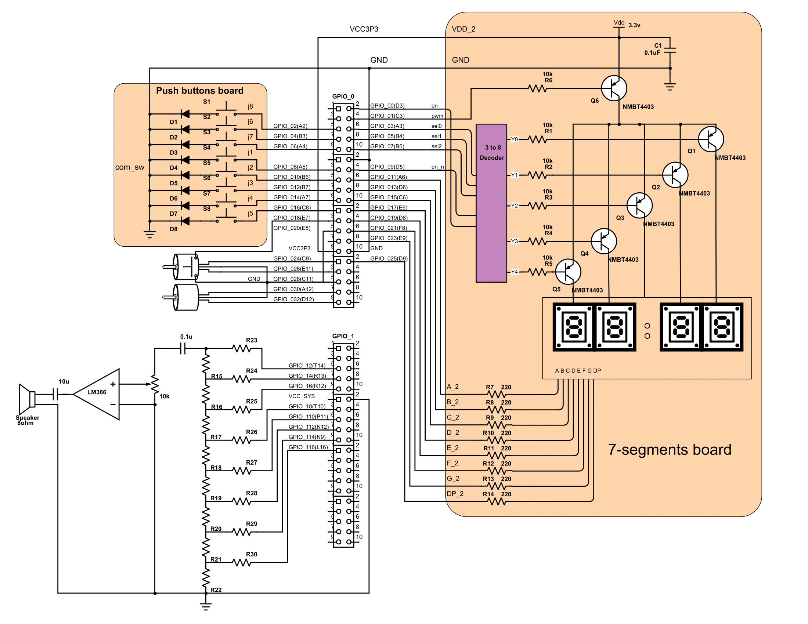
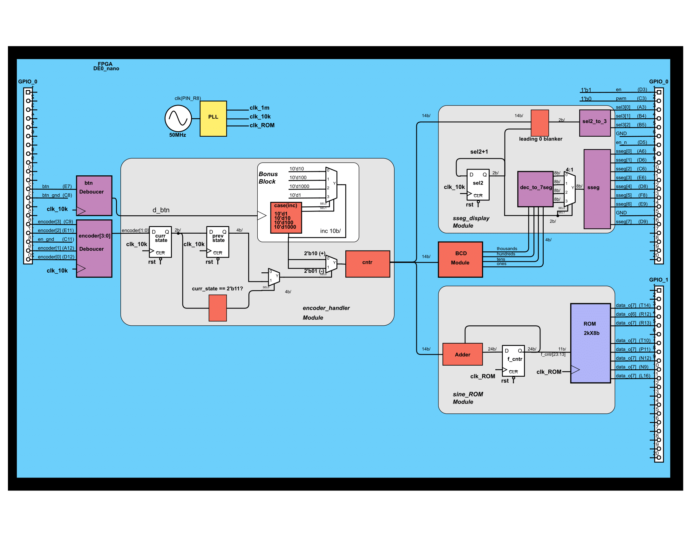

# ECE 474 Homework 5
### GCD engine - Designing with simple data and a mealy state machine

Your task for this homework is to implement Euclid's greatest common 
divisor (GCD) algorithm in synthesizble system verilog.

It will have two 32-bit inputs and one 32-bit output. It will be clocked
by a single clock and have an asynchonous active low reset input. The
input values will be validated with a start input and the rising edge
of the clock.  The output is validated with a one-cycle-wide done
signal that is synchronous to the clock.

Work to do:

1. Code your GCD engine using the module template shown below: It MUST be defined at 
its top level and named as shown below:
```verilog
module gcd( input [31:0] a_in,          //operand a
            input [31:0] b_in,          //operand b
            input start,                //validates the input data
            input reset_n,              //reset
            input clk,                  //clock
            output reg [31:0] result,  //output of GCD engine
            output reg done);          //validates output value
```
2. Test your gcd module using the supplied testbench to insure answers.  A 
   testbench that you can use to test the functionality will be
   posted for your aid in debugging.

What to turn in:
  An untared, unzipped file (gcd.sv) to TEACH by the due date. 
  Submitted physically in class on the due date:
    -a copy of your verilog code (a2ps only) 
    -your timing diagram and state machine diagram

Grading
  -Correct operation of gcd                   -90%
  -Code cleanliness, coding efficiency, style -10%

## RTL schematic created by Chauncey Yan with DigiKey Schemit



